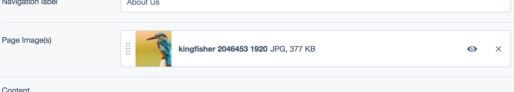
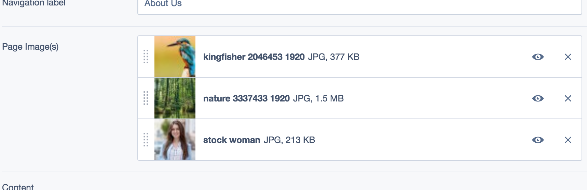

Extension to quickly add a featured image to a pagetype
=======================================================

## Features

* Adds a simple uploadfield to a page for a featuredimage



or set of featured images (max amount configurable)



## Requirements

* SilverStripe 4.1 or newer

## Installation

```
composer require restruct/silverstripe-featuredimages dev-master
```

## Apply extension to desired pagetypes:

Add to config.yml (max_featured_images is optional, default = 1):

```yaml
Page:
  extensions:
    - '\Restruct\SilverStripe\FeaturedImages\FeaturedImageExtension'
  max_featured_images: 3
```

And use in templates as 
```
$PageImage
```
or
```
<% loop $PageImages %>$Me<% end_loop %>
