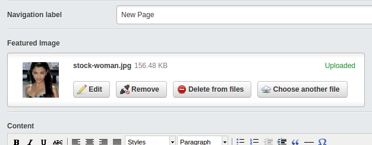

Extension to quickly add a featured image to a pagetype
=======================================================

## Features

* Adds a simple uploadfield to a page for a has_one featuredimage



## Requirements

* SilverStripe 3.0 or newer


## Installation

```
composer require micschk/silverstripe-featuredimages dev-master
```

## Apply extension to desired pagetypes:

Add to config.yml:

```yaml
Page:
  extensions:
    - 'FeaturedImageExtension'
```

And use in templates as 
```
$FeaturedImage
```
