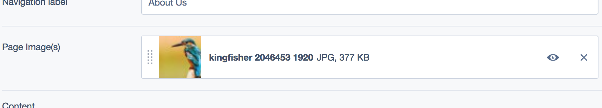
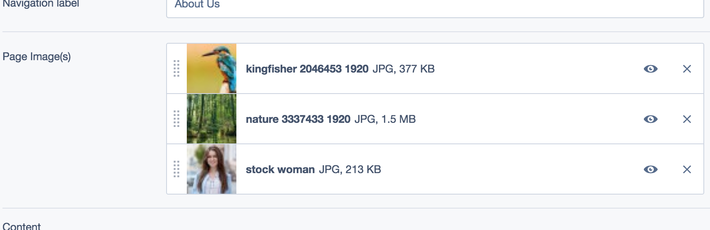

Extension to quickly add a featured image to a pagetype
=======================================================

## Features

* Adds a simple uploadfield to a page for a featuredimage



or set of featured images (max amount configurable)



## Requirements

* Silverstripe 5 or 6
* PHP 8.1 or newer

## Installation

```
composer require restruct/silverstripe-featuredimages
```

## Version compatibility

| Branch | Module version | Silverstripe | PHP |
|--------|----------------|--------------|-----|
| `main` | `5.x` | `^5 \|\| ^6` | `^8.1` |
| (tags only) | `4.1.x` | `^4 \|\| ^5 \|\| ^6` | `^7.4 \|\| ^8.0` |
| (tags only) | `4.0.x` | `^6` | `^8.3` |
| (tags only) | `3.x` | `^4 \|\| ^5` | `^7.1 \|\| ^8.0` |

Silverstripe 4 reached end of life in April 2025 and is no longer supported or tested here. Projects
still on it should stay on the `3.x` or `4.1.x` tags, which remain available.

`main` is the only maintained line: it supports every Silverstripe version this module still
targets, so there is no separate maintenance branch. A version branch will be created only when a
change cannot be made compatible across the supported range.

**`composer.json` is the source of truth** for exact constraints; this table is a quick reference.

## Apply extension to desired pagetypes:

Add to config.yml (max_featured_images is optional, default = 1):

```yaml
Page:
  extensions:
    - '\Restruct\SilverStripe\FeaturedImages\FeaturedImageExtension'
  max_featured_images: 3
```

And use in templates as 
```
$PageImage
```
or
```
<% loop $PageImages %>
    $Me
<% end_loop %>

## Running the tests

The module cannot be tested on its own: it needs a host Silverstripe project. Require it there
through a Composer **path repository with `symlink: true`** - `/tests` is `export-ignore`, so a dist
or mirrored install contains no tests - add its test namespace to the host's `autoload-dev`, then:

```bash
# Silverstripe 5 (PHPUnit 9) - the path must come before flush=1
vendor/bin/phpunit vendor/restruct/silverstripe-featuredimages/tests flush=1

# Silverstripe 6 (PHPUnit 11) - a flush=1 argument is ignored, use the env var
SS_PHPUNIT_FLUSH=1 vendor/bin/phpunit --testsuite featuredimages
```

CI runs the same suite against Silverstripe 4, 5 and 6 on every push; see
`.github/workflows/ci.yml`.
